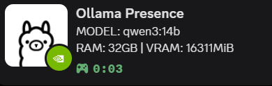
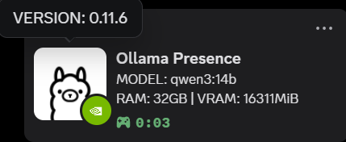
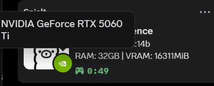

# Ollama Discord Rich Presence

<p align="center">
  
</p>

<p align="center">
  <strong>Display your Ollama model status in Discord with system information</strong>
</p>

<p align="center">
  
  
  
</p>

---

## 🚀 One-Click Install

**Windows (PowerShell):**
```powershell
curl -o install.py https://raw.githubusercontent.com/teodorgross/ollama-discord-presence/main/install.py; python install.py
```

**Windows (CMD):**
```cmd
curl -o install.py https://raw.githubusercontent.com/teodorgross/ollama-discord-presence/main/install.py && python install.py
```

**Linux/macOS:**
```bash
curl -sSL https://raw.githubusercontent.com/teodorgross/ollama-discord-presence/main/install.py | python3
```

## 🗑️ Uninstall

**Windows (PowerShell):**
```powershell
curl -o uninstall.py https://raw.githubusercontent.com/teodorgross/ollama-discord-presence/main/uninstall.py; python uninstall.py
```

**Windows (CMD):**
```cmd
curl -o uninstall.py https://raw.githubusercontent.com/teodorgross/ollama-discord-presence/main/uninstall.py && python uninstall.py
```

**Linux/macOS:**
```bash
curl -sSL https://raw.githubusercontent.com/teodorgross/ollama-discord-presence/main/uninstall.py | python3
```

---

## ✨ Features

<table>
<tr>
<td>

**🔄 Real-time Updates**  
Shows active Ollama models instantly

**💾 System Info**  
Displays RAM, VRAM, and GPU details

**🎨 Auto GPU Icons**  
NVIDIA/AMD/Intel logos automatically

</td>
<td>

**⚙️ Background Service**  
Runs silently, starts with system

**🖥️ Cross-Platform**  
Windows, macOS, Linux support

**📊 Rich Display**  
Model name, version, hardware stats

</td>
</tr>
</table>

---

## 🖼️ What You'll See

<p align="center">
  
  
</p>

- **Line 1:** Current model name
- **Line 2:** System RAM and GPU VRAM  
- **Icons:** GPU brand detection
- **Tooltips:** Ollama version and hardware details

---

## ⚙️ Custom Discord App (Optional)

Want to use your own Discord application? Edit `config.json`:

```json
{
  "clientId": "your-discord-app-id-here"
}
```

1. Create app at [Discord Developer Portal](https://discord.com/developers/applications)
2. Upload assets: `ollama`, `nvidia`, `amd`, `intel`, `gpu`
3. Copy Application ID to config
4. Restart service

---

## 🔧 Requirements

- 🐍 **Python 3.7+**
- 💬 **Discord Desktop App**
- 🦙 **Ollama installed**

## 📝 Logs & Debug

**Logs Location:**
- Windows: `%USERPROFILE%\.ollama\discord\logs.txt`
- Linux/Mac: `~/.ollama/discord/logs.txt`

**Debug Mode:**
```bash
python ollama_presence.py --debug
```

---

## 💡 For Ollama Team

This project demonstrates the value of Discord Rich Presence integration for Ollama users. Consider implementing native Discord RPC support in the main Ollama application to enhance user experience and community engagement.

**Benefits:**
- Increased visibility of Ollama usage
- Better community interaction
- Enhanced user status sharing
- No external dependencies needed

---

<p align="center">
  <sub>Made with ❤️ for the Ollama community</sub>
</p>
